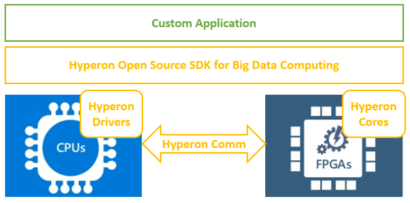

# Hyperon
FPGA Cores and Host Drivers for Big Data Computing Acceleration

# Table of Contents

1. [Overview of hyperon big data computing platform](#overview)
2. [Architecture](#architecture)
2. [Getting Started](#gettingstarted)
3. [FPGA Cores (HDK)](#fpgacores)
4. [Host Drivers (SDK)](#hostdrivers)

# Overview of Hyperon big data computing platform
Hyperon is a big data computing platform which is consisting of two pars: high performance IP cores and host drivers to allow developers get the FPGA acceleration power to their big data platforms effortlessly without any prior knowladge of the FPGA. Hyperon supports AWS F1 instances on the cloud and Alveo U200 board for on premis deployment.

# Architecture
Hyperon takes care of the deploying FPGA cores generate the host .dll which interacts with the IP and handles also all the communication between host and FPGA over DMA or over direct IO depending on the size of the data being transfered.

Hyperon simplified architecture is shown below.

# Getting Started

For getting started with the Hyperon acceleration platform the AWS F1 instance is needed for on cloud deployment or Alveo U200 board for the on premis deployment.

# FPGA Cores (HDK)

Hyperon accelerator platform currently have the following FPGA IP cores:

Text processing

* Regex
* Exact Word Search
* Text Similarity Matching

Array Processing

* Sort

Hashing

* Murmur3 32bit
* CRC
* MD5

Data Compression

* LZ

Linear Algebra

* Matrix Transpose
* Dot Product
* Norm Square
* Matrix Multiply

Regression

# Host Drivers (SDK)

Hyperon has the low level drivers which supports data movement between host and FPGA device both using direct IO or over DMA depending on the size of data. Host .dll hides all the complexity of dealing with data movement, optimizations and provides developer friendly API to effortlesly use Hyperon's library to integrate FPGA accelerated cores into different applications.  
